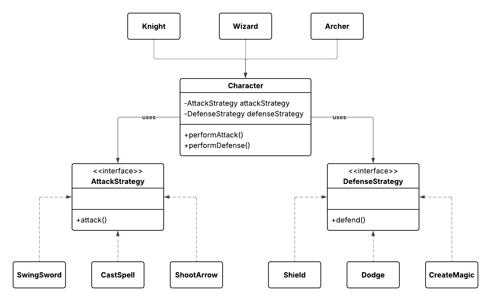

## GameApp - Strategy Pattern Implementation

A demonstration of the **Strategy Design Pattern** applied to a role-playing game with multiple character types and interchangeable combat strategies.

---

### Overview

This project implements a game application featuring three character types, each with unique attack and defense capabilities. The Strategy Pattern allows characters to dynamically switch between different attack and defense strategies at runtime.

---

### Character Types

#### 1. **Knight**
- **Attack**: Swings a sword in melee combat
- **Defense Options**: 
  - Shield (blocks physical attacks)
  - Dodge (evades incoming attacks)
  - Magic Barrier (absorbs magical damage)

#### 2. **Wizard**
- **Attack**: Casts powerful spells
- **Defense Options**: 
  - Magic Barrier (primary magical defense)

#### 3. **Archer**
- **Attack**: Shoots arrows from range
- **Defense Options**: 
  - Dodge (relies on agility to avoid attacks)

---

### Strategy Pattern Implementation

The application implements two main strategy interfaces:

#### A. **DefenseStrategy**

Defines how characters protect themselves from incoming attacks.

1. **Shield**
   - Physical barrier that blocks direct attacks
   - High durability, reduces damage significantly
   - Best against melee and projectile attacks

2. **Dodge**
   - Evasive maneuver to avoid attacks entirely
   - Requires agility and timing
   - Effective against all attack types when successful

3. **CreateMagic** (Magic Barrier)
   - Magical shield that absorbs damage
   - Particularly effective against spell-based attacks
   - Consumes mana/energy to maintain

#### B. **AttackStrategy**

Defines how characters deal damage to opponents.

1. **CastSpell**
   - Ranged magical attack
   - High damage potential
   - Effective against armored enemies

2. **ShootArrow**
   - Ranged physical attack
   - Precise and quick
   - Good balance of range and damage

3. **SwingSword**
   - Melee physical attack
   - High damage at close range
   - Requires positioning near the target

Below is the **UML Class Diagram** for this project:

